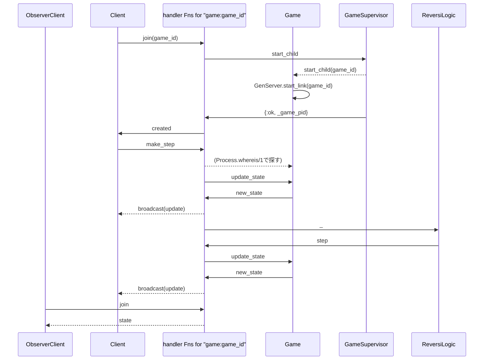
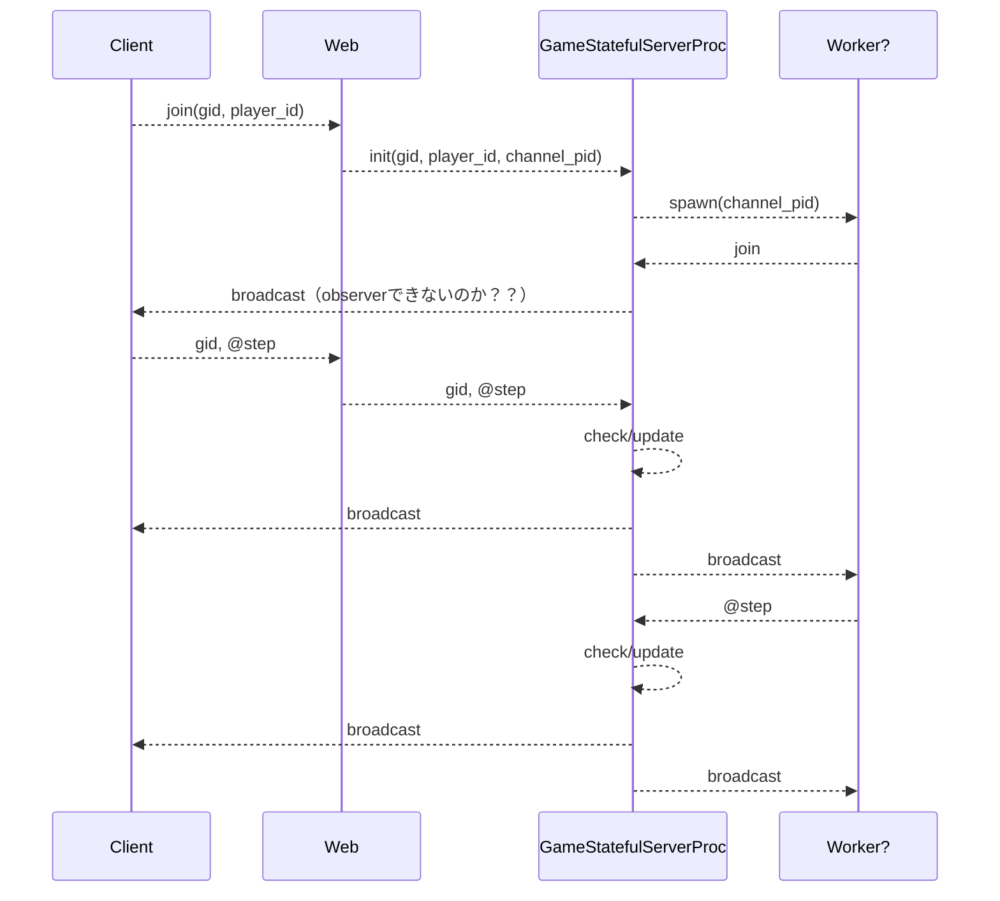

# ReversiServer

To start your Phoenix server:

  * Install dependencies with `mix deps.get`
  * Create and migrate your database with `mix ecto.create && mix ecto.migrate`
  * Install Node.js dependencies with `cd assets && npm install`
  * Start Phoenix endpoint with `mix phx.server`

Now you can visit [`localhost:4000`](http://localhost:4000) from your browser.

Ready to run in production? Please [check our deployment guides](http://www.phoenixframework.org/docs/deployment).

## Learn more

  * Official website: http://www.phoenixframework.org/
  * Guides: http://phoenixframework.org/docs/overview
  * Docs: https://hexdocs.pm/phoenix
  * Mailing list: http://groups.google.com/group/phoenix-talk
  * Source: https://github.com/phoenixframework/phoenix

## Sequence diagram (written in mermaid.js)

### Another way of communication: pub/sub channel internally

See <https://hexdocs.pm/phoenix/Phoenix.Channel.html#module-subscribing-to-external-topics>

